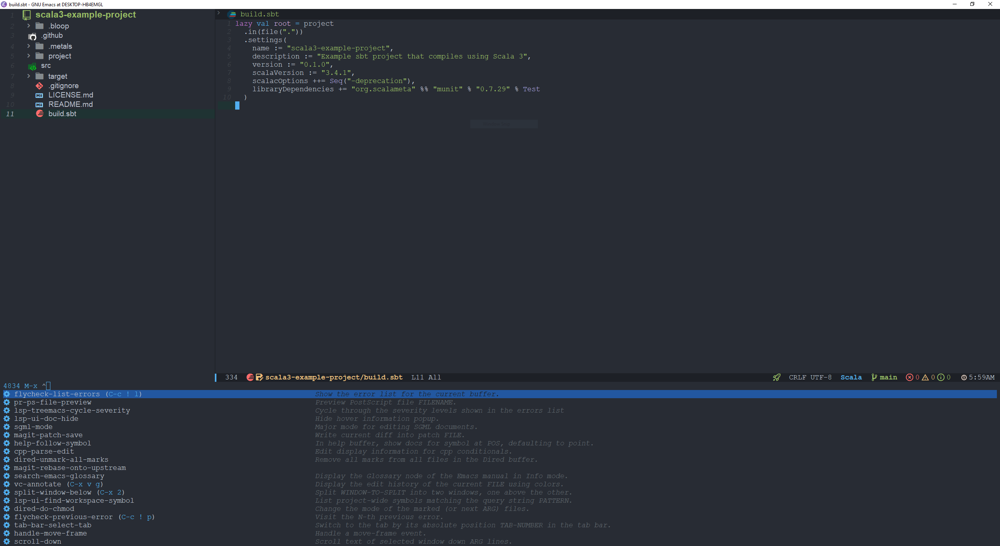

# Emacs scala
## Dependencies
- [Doom theme](https://github.com/doomemacs/themes)
- [Doom modeline](https://github.com/seagle0128/doom-modeline)
- [Magit](https://github.com/magit/magit)
- [Treemacs](https://github.com/Alexander-Miller/treemacs)
- [Scala metals](https://scalameta.org/metals/docs/editors/emacs/)
- [Ivy](https://github.com/abo-abo/swiper)
## Install fonts
Download and install fonts

Nerd fonts `M-x nerd-icons-install-fonts`

All the icons fonts `M-x all-the-icons-install-fonts`

## Screenshot

